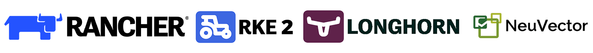

#### Zack Brady, Field Engineer, Rancher Government Solutions (RGS)
#### [@zackbradys](https://twitter.com/zackbradys) - zack.brady@ranchergovernment.com - https://rancher.com/government

# **Welcome to the official overview for *kit-ernetes*!!**

### Table of Contents
  * [About Me](#about-me)
  * [Overview](#overview)
  * [Architecture](#architecture)
  * [Equipment and Parts](#equipment-and-parts)
  * [Installs and Deployments](#installs-and-deployments)
  * [Setup and Configuration](#setup-and-configuration)
  * [Final Thoughts](#final-thoughts)
  * [Conclusion](#conclusion)

## About Me

A little bit about me and my history in the industry. If you have any questions, please reach out to me at zbrady@zackbrady.com!

- Former Contractor
- U.S. Military Reservist
- Open-Source Contributor
- Built and Exited a Digital Firm
- Active Volunteer Firefighter/EMT

## Overview

**kiternetes is a set of scalable, tactical, and deployable backpack kits, featuring the complete Rancher stack.**

- Harvester (HCI) - [click to learn more](https://www.rancher.com/products/harvester)
- RKE2 (Kubernetes Engine) - [click to learn more](https://www.rancher.com/products/rke)
- Rancher Manager (Cluster Management) - [click to learn more](https://www.rancher.com/products/rancher)
- Longhorn (Storage) - [click to learn more](https://www.rancher.com/products/longhorn)
- Neuvector (Security) - [click to learn more](https://ranchergovernment.com/neuvector)
- and various minor tools/dependencies (more info below)

### *So what does that mean?*

At a basic level, kiternetes is a five node kuberenetes cluster.

At a complex level, kiternetes is a

## Architecture

## Equipment and Parts

Physical Kits        |         Accessories
:-------------------------:|:-------------------------:
 |  

## Installs and Deployments

## Setup and Configuration

## Final Thoughts

## Conclusion

